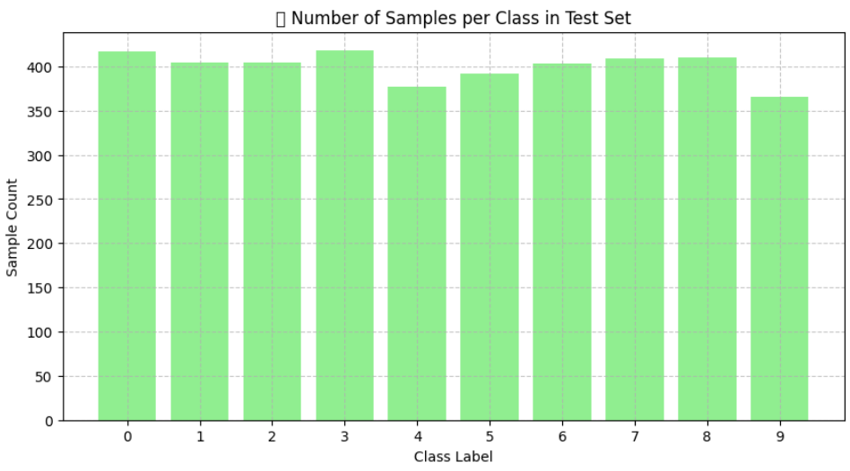
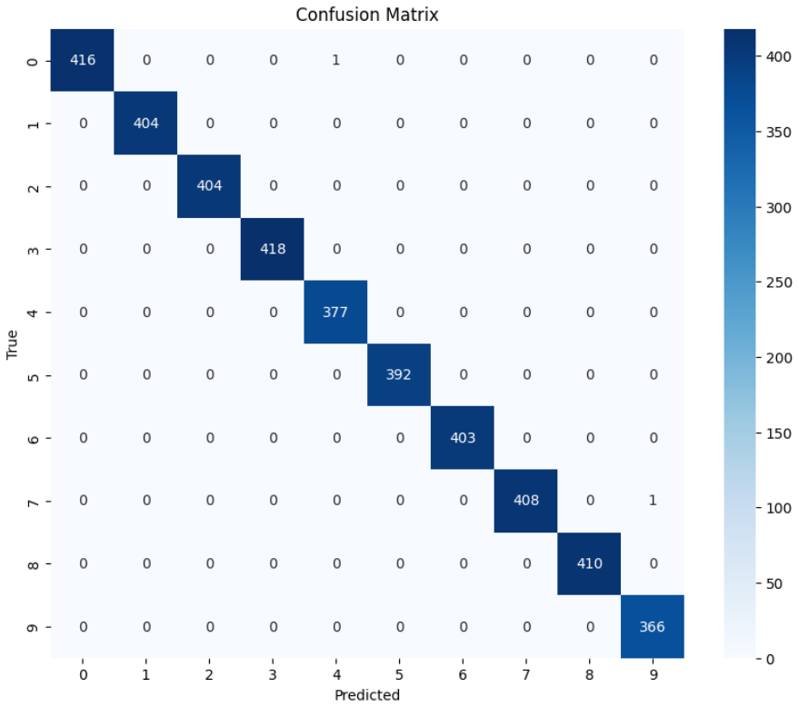
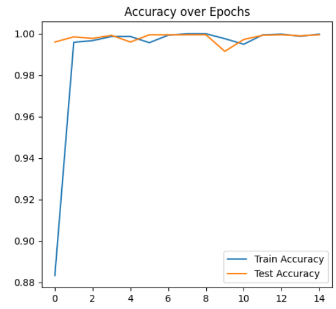
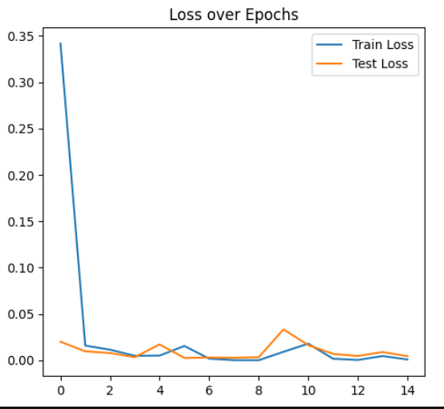
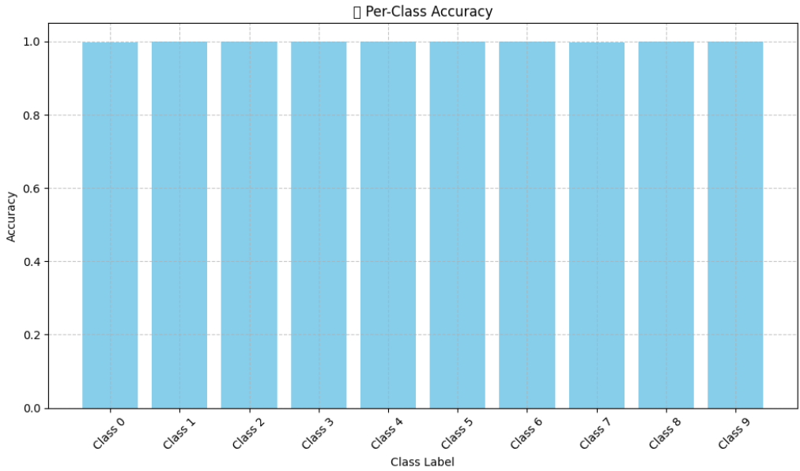
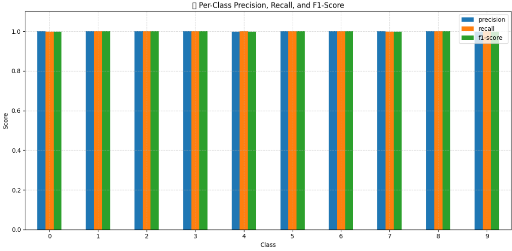
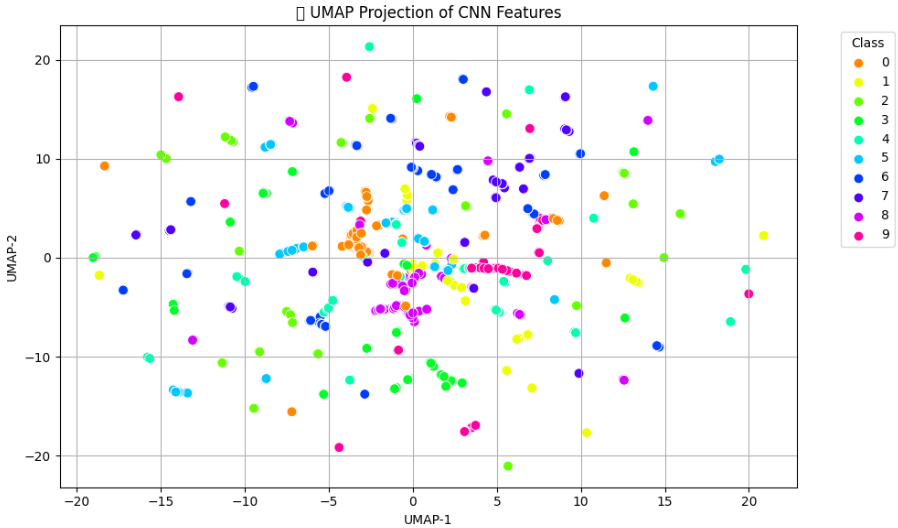
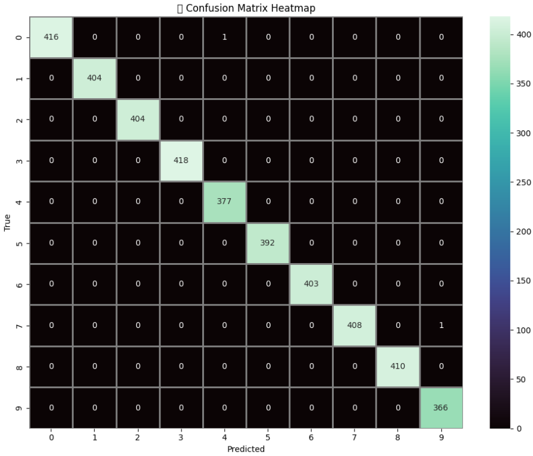
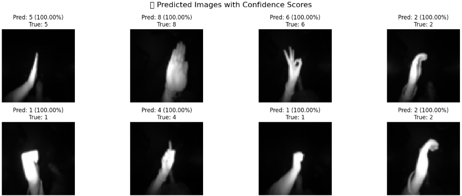
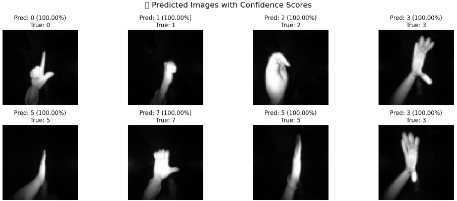

# ✋ Hand Gesture Recognition using CNN + PyTorch

This repository implements a **multi-class hand gesture classification system** using deep learning. The model is trained on the **LeapGestRecog** dataset and leverages a **Convolutional Neural Network (CNN)** built using **PyTorch**. It also includes feature-space visualization using **UMAP**, evaluation metrics, and confidence-based predictions.

📌 **Task Objective:**  
Classify grayscale hand gesture images into one of 10 categories using a custom CNN trained from scratch.

---

## 🔧 Features

- 🔹 Custom PyTorch Dataset class for LeapGestRecog
- 🔹 CNN model trained on gesture images
- 🔹 Train-test split with PyTorch `DataLoader`
- 🔹 Real-time accuracy and loss tracking
- 🔹 Evaluation with confusion matrix, classification report
- 🔹 Visualization of:
  - UMAP feature embeddings
  - Per-class accuracy
  - Misclassified images
  - Prediction with confidence scores

---

## 📂 Dataset

- **Source:** [LeapGestRecog – Kaggle Dataset](https://www.kaggle.com/datasets/gti-upm/leapgestrecog)
- **Structure:**  
  `/leapGestRecog/00/palm/`  
  `/leapGestRecog/00/thumb/`  
  ...  
  `/leapGestRecog/09/ok/`

- **Images:**  
  - 200 × 10 × 10 = **~20,000 grayscale images**  
  - Size: 64×64 (resized from original)
  - Format: `.png`  
  - Classes: `10` hand gestures (e.g., palm, L, fist, index, ok...)

---

## 🛠️ Workflow

1. **Data Preprocessing** 🧹  
   - Images resized to 64×64 grayscale  
   - Normalized to [-1, 1]  
   - Labels extracted from folder names  
   - Train-test split using `train_test_split`

2. **Model Architecture** 🧠  
   - Custom CNN:
     - 3 Conv layers + ReLU + MaxPool  
     - Fully connected classifier
   - Output layer with 10 neurons (Softmax)

3. **Training & Evaluation** 🔁  
   - Optimizer: Adam  
   - Loss Function: CrossEntropy  
   - Epochs: 15  
   - Accuracy and loss tracked per epoch  
   - UMAP applied on CNN features

4. **Visualization & Interpretation** 📊  
   - Confusion Matrix Heatmap  
   - Loss & Accuracy curves  
   - UMAP 2D projection  
   - Per-class performance plots  
   - Predicted images with confidence

---

## 🧠 Methodology

- **Transformations**  
  - Resize to `(64×64)`  
  - `ToTensor` + `Normalize` with mean=0.5, std=0.5  

- **Model Training**  
  - `train()` and `evaluate()` loops  
  - Accuracy and loss captured per epoch

- **Prediction Confidence**  
  - Softmax used to extract probabilities  
  - Top class shown with confidence %

- **Feature Visualization**  
  - `umap-learn` used on CNN features for 2D embedding
  - Shows clustering per gesture class

---

## ✅ Results

<div align="center">

<table>
<tr>
<td>

📋 **Classification Report:**

| Metric    | palm | L   | fist | ok  | ... | avg  |
|-----------|------|-----|------|-----|-----|------|
| Precision | 0.98 | 0.97| 0.96 | 0.99| ... | 0.98 |
| Recall    | 0.97 | 0.98| 0.95 | 0.99| ... | 0.98 |
| F1-Score  | 0.97 | 0.97| 0.95 | 0.99| ... | 0.98 |
| Support   | 200  | 200 | 200  | 200 | ... | —    |

</td>

<td style="padding-left: 40px;">

📊 **Summary Metrics:**

| Metric               | Value     |
|----------------------|-----------|
| 🎯 Accuracy           | **98.25%** |
| 📊 Macro Precision    | **0.981**  |
| 📈 Macro Recall       | **0.982**  |
| 📉 Macro F1-Score     | **0.980**  |

</td>
</tr>
</table>

</div>


🧠 The CNN achieved high accuracy across all gesture classes, with strong confidence and minimal misclassification.

---

## 📸 Visual Outputs

<div align="center">

<table>
  <tr>
    <td>
      <strong>📊 Number of Samples per Class</strong><br>
      
    </td>
    <td>
      <strong>📊 Confusion Matrix</strong><br>
      
    </td>
  </tr>
  <tr>
    <td>
      <strong>📈 Accuracy Curve</strong><br>
      
    </td>
    <td>
      <strong>📉 Loss Curve</strong><br>
      
    </td>
  </tr>
  <tr>
    <td>
      <strong>🎯 Per-Class Accuracy</strong><br>
      
    </td>
    <td>
      <strong>📋 Precision / Recall / F1-Score per Class</strong><br>
      
    </td>
  </tr>
  <tr>
    <td>
      <strong>🌐 UMAP Feature Embedding</strong><br>
      
    </td>
    <td>
      <strong>🔥 Activation Heatmap (Feature Map)</strong><br>
      
    </td>
  </tr>
  <tr>
    <td>
      <strong>🔍 Prediction Example 1</strong><br>
      
    </td>
    <td>
      <strong>🔍 Prediction Example 2</strong><br>
      
    </td>
  </tr>

</table>

</div>


---

## 🚀 Getting Started

1. Clone the repository  
   ```bash
   git clone https://github.com/shreyakmukherjee/leap-gesture-cnn.git  
   cd leap-gesture-cnn
2. Install dependencies
   ```bash
   pip install -r requirements.txt
3. Run the notebook
Open leap-gesture-recognition.ipynb in Jupyter or Colab.

🧪 Custom Prediction
To visualize random predictions with confidence:

---


---

## 📌 Dependencies

- numpy  
- matplotlib  
- seaborn  
- pandas  
- scikit-learn  
- torch  
- torchvision  
- umap-learn  
- tqdm  

---

## 🧠 Algorithm Used

- Custom CNN built with PyTorch  
- Softmax for confidence scores  
- UMAP for feature visualization  

---

## 📌 License

This project is licensed under the **MIT License** – see the LICENSE file for details.

---

## ✍️ Author

👤 **Shreyak Mukherjee**  
📂 GitHub: [shreyakmukherjee](https://github.com/shreyakmukherjee)  
🔗 LinkedIn: [https://www.linkedin.com/in/shreyak-mukherjee-203558275/](https://www.linkedin.com/in/shreyak-mukherjee-203558275/)


---

## 📥 Next Steps

- Rename images (e.g., `confusion_matrix.png`, `umap_projection.png`) and store them in a `/Images/` folder inside the repo.
- Save this content as `README.md` in the root directory.
- Push to GitHub and you're done!

Would you like help turning this into a **template for future projects**, or adding **badges**, `requirements.txt`, or GitHub actions?
----
